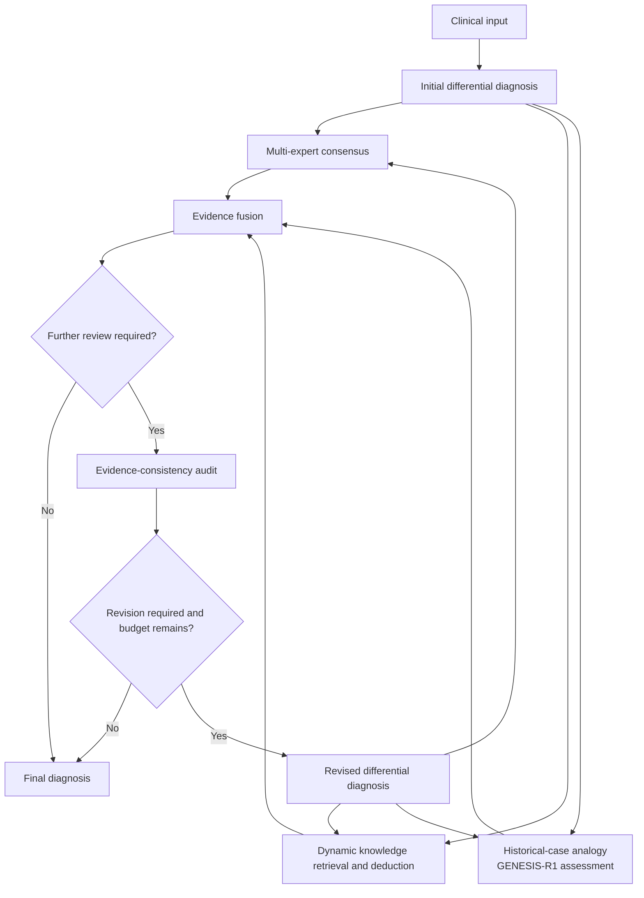

# GENESIS

English | [简体中文](README.zh-CN.md)

GENESIS is the complete multi-agent diagnostic system. GENESIS-R1 is its specialised medical diagnostic reasoning model, trained with medical knowledge, diagnostic chains of thought and diagnosis-task reinforcement learning.

GENESIS-R1 proposes a differential, three evidence pathways examine it from
complementary perspectives, Evidence fusion ranks the candidates, and an
Evidence-consistency audit determines whether revision is needed.

This repository is the orchestration layer. It depends only on the Python
standard library, and connects to your own models and retrieval indices through
seven small interfaces.

## How it runs



GENESIS-R1 handles diagnostic reasoning, evidence interpretation, fusion, audit
and revision. A smaller auxiliary language model handles simpler tasks quickly:
extracting clinical findings for HPO mapping, checking retrieved material against
candidate diagnoses and extracting useful passages from long documents. We use
Qwen3-8B for these tasks. Qwen3-Embedding-8B is the separate embedding model used
for vector retrieval.


**1. Initial differential diagnosis.** The reasoning model reads the case and returns a ranked
differential. Each candidate carries the findings that support it, the findings
that contradict it, the questions left open, and its rationale.

**2.1 Multi-expert consensus.** Asks whether the differential is reproducible
across independent diagnostic methods, and what those methods propose that the
differential omits. Agreement — presence and relative position in each ranked
list — is computed in code; the model is asked only to interpret it.

**2.2 Dynamic knowledge retrieval and deduction.** Queries the knowledge indices per candidate along
three axes: defining features, contradictory findings, mechanism. Retrieved
records are attached as evidence, passed through as retrieved by default.

**2.3 Historical-case analogy.** Retrieves historical cases using phenotype terms,
clinical narratives or candidate disease names. The auxiliary model checks
whether a retrieved case’s reported diagnosis matches a candidate diagnosis.
GENESIS-R1 compares the current patient’s symptoms, findings and disease course
with the retrieved cases, explaining which findings support or argue against
each candidate. It can also suggest other diagnoses documented in those cases
when the patient’s findings justify considering them. The comparison and cited
case records are passed to Evidence fusion.

**3. Evidence fusion.** Ranks the candidates against everything retrieved, and produces
the answer the caller receives. Runs every round, so the differential returned
always reflects the evidence rather than only the initial proposal.

**4. Evidence-consistency audit.** Runs when fusion could not settle the case. Classifies each
candidate as *consensus*, *contested* or *emerged*, then names what is missing:
unsupported claims, conflicting findings, evidence gaps, proposed alternatives.

**5. Revised differential diagnosis.** The same model that proposed the differential is given the case
again, its own previous candidates, the records each of them accumulated across
the three pathways, and the audit report. It may keep, drop, reorder or introduce
candidates. Whatever it introduces goes back through retrieval at greater depth
— three queries per candidate instead of one, ten records per source instead of
three — while evidence already collected remains available. The default
`max_rounds=3` permits one initial cycle and at most three revisions, for up to
four evidence-and-fusion cycles. `max_rounds=2` permits at most three total cycles.

GENESIS-R1 receives the full case text for diagnosis, query planning, case analogy, fusion,
audit and revision. Auxiliary passage extraction receives the candidate and
retrieved record. Final diagnosis is assembled from the last completed cycle.

## Methods and model documentation

- [Model documentation](docs/model_documentation.md) — training architecture, resource composition, synthetic-data construction, quality review, resource versions, access terms and multi-agent organisation.
- [Prompt reference](docs/prompts.md) — complete templates from the source code.

## Install

```bash
python3 -m pip install -e .        # no runtime dependencies
```

Python 3.10+.

## Usage

Run the bundled dataset with no services running:

```bash
python3 examples/run_dataset.py
```

Then point it at a model:

```bash
python3 examples/run_dataset.py --base-url http://localhost:8000/v1 \
                                --model GENESIS-R1 \
                                --auxiliary-base-url http://localhost:8001/v1 \
                                --auxiliary-model Qwen3-8B
```

In code:

```python
import asyncio
from genesis import Config, Models, Tools, diagnose
from genesis.llm.openai_compat import OpenAIChat

from genesis.tools import ModelPhenotypeExtractor, ModelEvidenceSummarizer

reasoner = OpenAIChat("http://localhost:8000/v1", "GENESIS-R1")
auxiliary = OpenAIChat("http://localhost:8001/v1", "Qwen3-8B", thinking=False)

result = asyncio.run(diagnose(
    case_text,
    models=Models(reasoner=reasoner, auxiliary=auxiliary),
    tools=Tools(
        phenotype_extractor=ModelPhenotypeExtractor(auxiliary),
        summarizer=ModelEvidenceSummarizer(auxiliary),
        # Add expert_methods, knowledge_sources and case_indices here.
    ),
    config=Config(k=5, max_rounds=3),
))

result.top_k              # ranked differential
result.consistency_met    # did it settle?
result.to_dict()          # the answer in the q1_diagnoses schema
result.cycles             # candidates, evidence and audit for every round
# For an analogy report in result.cycles[i].reports:
# report.synthesis contains the parsed GENESIS-R1 case-analogy output.
```

Network access and individual source switches are configured separately; see [Inference](docs/inference.md#network-access-and-source-configuration) and the [external tool inventory](docs/resources.md#external-retrieval-tools-and-services).

## Interfaces

Retrieval indices and model weights stay on your side of seven protocols, so the
same workflow runs against whatever stack you have — ontology snapshots, a
literature index, a case corpus, a single JSON file:

| Protocol             | Supplies                                                     |
| -------------------- | ------------------------------------------------------------ |
| `ChatModel`          | `chat(system, user) -> str`                                  |
| `PhenotypeExtractor` | free text → normalized findings, keeping pertinent negatives |
| `ConceptNormalizer`  | disease name → ontology ids, so labels can be consolidated   |
| `ExpertMethod`       | one independent ranked differential                          |
| `KnowledgeSource`    | one queryable knowledge index                                |
| `CaseIndex`          | historical-case retrieval                                    |
| `EvidenceSummarizer` | optional: condense a record instead of passing it through    |

Every tool is optional. Knowledge retrieval activates when a knowledge source
is configured; a summarizer is not required. Without a summarizer, original
records are retained with a neutral stance. See [Inference](docs/inference.md)
for complete model roles, auxiliary configuration and the minimal setup.

`examples/run_dataset.py` implements four of them against plain JSON files,
showing the inputs and outputs expected by each protocol.
`genesis/llm/openai_compat.py` is a worked `ChatModel` for any
OpenAI-compatible server: vLLM, SGLang, Ollama, most gateways.

## Dataset

`minimal_dataset/` holds three cases and three small indices, enough to exercise
the workflow end to end. The cases cover the input shapes it has to handle: an
English narrative with laboratory and histology detail, a pre-extracted phenotype
list with pertinent negatives, and a Chinese narrative whose decisive clues live
in the prose. See `minimal_dataset/README.md`.

## Licence

Apache License 2.0 — see [LICENSE](LICENSE).

The licence covers the code in this repository: the workflow, the agents, the
prompts and the examples. It does not extend to anything you connect through the
tool protocols. Model weights, ontology snapshots, literature corpora and case
collections each carry their own terms, and several of the resources this kind of
system is usually built on are redistributable only under conditions of their
own. Check the terms of each before deploying.

`minimal_dataset/` is released under the same licence as the code. The cases were
written for this repository and are not derived from patient records; the index
entries are short original summaries rather than reproduced source text.
