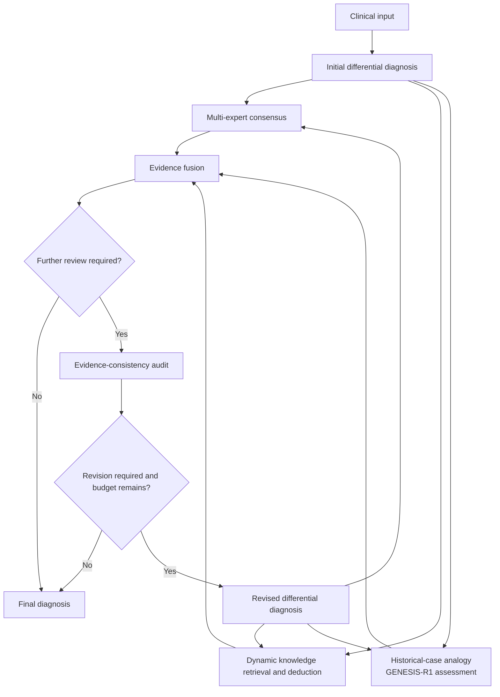

# GENESIS

[English](README.md) | 简体中文

GENESIS 是完整的多智能体诊断系统。GENESIS-R1 是其中的专业医学诊断推理模型，通过医学知识、诊断思维链及诊断任务强化学习训练得到。

GENESIS-R1 提出鉴别诊断，三个证据路径从互补的角度检验这些诊断，
Evidence fusion 对候选诊断排序，
Evidence-consistency audit 判断是否需要修订。

本仓库提供工作流编排层，仅依赖 Python 标准库，
通过七个简洁的接口连接
用户自己的模型和检索索引。

## 运行流程



GENESIS-R1 负责诊断推理、证据解释、融合、审查和修订。
较小的辅助语言模型用于快速处理简单任务：
提取用于 HPO 映射的临床表现、检查检索材料与
候选诊断的对应关系，以及从长文档中提取有效片段。
这些任务采用 Qwen3-8B。Qwen3-Embedding-8B 是独立的嵌入模型，
用于向量检索。


**1. Initial differential diagnosis（初步鉴别诊断）。** 推理模型读取病例，返回排序后的
鉴别诊断。每个候选诊断包含支持它的表现、
与之矛盾的表现、尚未解决的问题及诊断理由。

**2.1 Multi-expert consensus（多专家共识）。** 检查不同独立诊断方法
是否给出一致的鉴别诊断，以及这些方法提出了哪些
当前鉴别诊断遗漏的疾病。候选疾病在各排序列表中是否出现、相对位置如何，
由代码计算；模型只负责解释这种一致性的诊断意义。

**2.2 Dynamic knowledge retrieval and deduction（动态知识检索与推断）。** 围绕每个候选诊断，
从典型特征、矛盾表现和疾病机制三个方向查询知识索引。
检索记录作为证据附加，默认保留检索所得的原始内容。

**2.3 Historical-case analogy（历史病例类比）。** 使用表型术语、
临床叙述或候选疾病名称检索历史病例。辅助模型检查
检索病例记载的诊断是否与某个候选诊断匹配。
GENESIS-R1 将当前患者的症状、检查结果及病程
与检索病例比较，解释哪些表现支持或反对
各候选诊断。当前患者的表现值得考虑其他诊断时，
它也可以提出检索病例中记载的其他疾病。比较结果和引用的
病例记录一起传递给 Evidence fusion。

**3. Evidence fusion（证据融合）。** 综合所有检索材料对候选诊断排序，
生成返回给调用方的答案。该阶段在每轮运行，确保返回的鉴别诊断
反映已获得的证据，而非仅重复初始提议。

**4. Evidence-consistency audit（证据一致性审查）。** 当融合结果仍需进一步审查时运行。将各
候选诊断归类为 *consensus*（共识）、*contested*（有争议）或 *emerged*（新出现），并指出：
缺乏支持的论断、矛盾表现、证据缺口以及建议考虑的其他诊断。

**5. Revised differential diagnosis（修订鉴别诊断）。** 最初提出鉴别诊断的模型再次接收
原始病例、先前的候选诊断、每个候选诊断从
三条路径积累的记录以及审查报告。模型可以保留、删除、重排或引入
候选诊断。新引入的候选诊断将进入更深入的检索，
每个候选诊断由一次查询增加到三次，每个来源的记录数由三条增加到
十条；此前收集的证据仍然可用。默认
`max_rounds=3` 允许一次初始循环及最多三次修订，即最多
四次证据检索与融合循环。`max_rounds=2` 则允许最多三次总循环。

GENESIS-R1 在诊断、查询规划、病例类比、融合、
审查和修订时接收完整病例文本。辅助片段提取接收候选诊断和
检索记录。Final diagnosis 由最后完成的一轮结果组装而成。

## 方法与模型说明

- [模型说明](docs/zh-CN/model_documentation.md) — 训练架构、资源构成、合成数据构建、质量审查、资源版本、访问条款及多智能体组织结构。
- [Prompt 参考](docs/zh-CN/prompts.md) — 源代码中的完整模板。

## 安装

```bash
python3 -m pip install -e .        # no runtime dependencies
```

Python 3.10 或更高版本。

## 使用

无需启动服务，即可运行仓库附带的数据集：

```bash
python3 examples/run_dataset.py
```

随后可指定模型服务：

```bash
python3 examples/run_dataset.py --base-url http://localhost:8000/v1 \
                                --model GENESIS-R1 \
                                --auxiliary-base-url http://localhost:8001/v1 \
                                --auxiliary-model Qwen3-8B
```

在代码中使用：

```python
import asyncio
from genesis import Config, Models, Tools, diagnose
from genesis.llm.openai_compat import OpenAIChat

from genesis.tools import ModelPhenotypeExtractor, ModelEvidenceSummarizer

reasoner = OpenAIChat("http://localhost:8000/v1", "GENESIS-R1")
auxiliary = OpenAIChat("http://localhost:8001/v1", "Qwen3-8B", thinking=False)

result = asyncio.run(diagnose(
    case_text,
    models=Models(reasoner=reasoner, auxiliary=auxiliary),
    tools=Tools(
        phenotype_extractor=ModelPhenotypeExtractor(auxiliary),
        summarizer=ModelEvidenceSummarizer(auxiliary),
        # Add expert_methods, knowledge_sources and case_indices here.
    ),
    config=Config(k=5, max_rounds=3),
))

result.top_k              # ranked differential
result.consistency_met    # did it settle?
result.to_dict()          # the answer in the q1_diagnoses schema
result.cycles             # candidates, evidence and audit for every round
# For an analogy report in result.cycles[i].reports:
# report.synthesis contains the parsed GENESIS-R1 case-analogy output.
```

联网权限和各来源开关可分别配置，参见[推理方法](docs/zh-CN/inference.md#联网与来源配置)及[外部工具清单](docs/zh-CN/resources.md#外部检索工具与服务)。

## 接口

检索索引和模型权重通过七个协议与工作流连接，
同一工作流可使用不同的部署资源，包括本体快照、
文献索引、病例语料库或单个 JSON 文件：

| 协议 | 提供的能力 |
| -------------------- | ------------------------------------------------------------ |
| `ChatModel`          | `chat(system, user) -> str`                                  |
| `PhenotypeExtractor` | 自由文本 → 规范化临床表现，保留相关阴性表现 |
| `ConceptNormalizer` | 疾病名称 → 本体标识符，用于合并不同名称 |
| `ExpertMethod` | 一份独立的排序鉴别诊断 |
| `KnowledgeSource` | 一个可查询的知识索引 |
| `CaseIndex` | 历史病例检索 |
| `EvidenceSummarizer` | 可选：浓缩记录内容，而非原样传递 |

所有工具均为可选。配置知识来源后即可启用知识检索，
无需配置 summarizer。未配置 summarizer 时，原始
记录以中立立场保留。完整模型分工、辅助模型配置及最小部署示例，
参见[推理方法](docs/zh-CN/inference.md)。

`examples/run_dataset.py` 基于普通 JSON 文件实现了其中四个接口，
展示各协议所需的输入和输出。
`genesis/llm/openai_compat.py` 提供可用的 `ChatModel` 实现，支持
OpenAI 兼容服务，包括 vLLM、SGLang、Ollama 及大多数网关。

## 数据集

`minimal_dataset/` 包含三个病例和三个小型索引，足以端到端运行
工作流。这些病例覆盖工作流需要处理的输入形式：
含化验和组织学细节的英文叙述、预先提取且保留相关阴性表现的
表型列表，以及关键线索包含在文本中的
中文病例叙述。参见 `minimal_dataset/README.md`。

## 许可

Apache License 2.0 — 参见 [LICENSE](LICENSE)。

该许可覆盖本仓库的代码：工作流、智能体、
prompt 和示例，不延伸至通过工具协议接入的
外部资源。模型权重、本体快照、文献语料库及病例
集合分别适用各自的条款；此类系统常用的部分资源
只有满足其特定条件后才允许再分发。
部署前请核对各项资源的使用条款。

`minimal_dataset/` 与代码使用同一许可。其中病例为
本仓库编写，并非来自患者记录；索引条目是
原创简短摘要，而非转载的来源文本。
