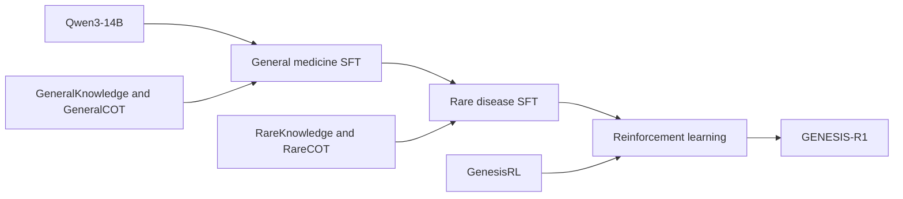

# GENESIS model documentation

## Model and training

GENESIS combines a medical reasoning model with three complementary evidence pathways and iterative evidence review. GENESIS-R1 proposes and revises a differential diagnosis; the evidence pathways evaluate the candidates using expert agreement, biomedical knowledge and similar cases.

### Model architecture

GENESIS-R1 is initialised from Qwen3-14B, an approximately 14-billion-parameter language model. Adaptation first develops general clinical reasoning, then extends this foundation to rare-disease knowledge and diagnostic reasoning. Supervised fine-tuning (SFT) uses knowledge question–answer pairs and structured diagnostic trajectories. Reinforcement learning (RL) further develops diagnostic reasoning across general and rare diseases.



### Training datasets

Counts below describe the training-resource composition reported in the manuscript. The unit is a question–answer pair, a reasoning trajectory or an RL prompt, as specified for each resource.

| Resource | Records | Unit | Training role |
| --- | ---: | --- | --- |
| GeneralKnowledge | 102,563 | Knowledge question–answer pairs | General medicine SFT |
| GeneralCOT | 139,573 | Structured diagnostic trajectories | General medicine SFT |
| RareKnowledge | 64,099 | Knowledge question–answer pairs | Rare disease SFT |
| RareCOT | 103,282 | Structured diagnostic trajectories | Rare disease SFT |
| GenesisRL | 21,497 | Rollout prompts | RL across general and rare diseases |
| RL validation | 100 | Held-out prompts | Validation |

#### General medicine resources

**GeneralKnowledge** covers clinical presentation, differential diagnosis, disease mechanisms, investigation selection and therapeutic decision-making. Sources include ICD-10 and MONDO; national clinical guidelines, expert consensus statements and care pathways; antimicrobial prescribing principles and drug references; PubTator; PrimeKG and Monarch; and the MIMIC-IV and PMC-Patients case corpora.

**GeneralCOT** contains diagnostic trajectories constructed from MIMIC-IV and PMC-Patients. Free-text cases are presented with different amounts of clinical information to support reasoning from both complete and restricted case descriptions.

#### Rare disease resources

**RareKnowledge** represents rare-disease knowledge derived from HPO, Orphanet, OMIM, MONDO and MAxO as question–answer pairs.

**RareCOT** contains structured trajectories constructed from RareArena cases outside the evaluation split. Trajectories represent hypothesis generation, evidence assessment and diagnostic revision. Input construction varies both representation (clinical text or standardised phenotype terms) and information completeness (full or partial).

#### Reinforcement learning resources

**GenesisRL** combines general-medicine and rare-disease prompts in a shared curriculum. Tasks span hard and extreme difficulty levels, with a shared reward framework across the disease-prevalence spectrum. Multi-source knowledge and reflection-enhanced sampling support exposure to alternative reasoning paths. The validation set contains 100 additional prompts.

### From training to inference

Knowledge question–answer pairs support disease understanding, diagnostic trajectories teach hypothesis evaluation, and RL refines the diagnostic reasoning process. At inference, GENESIS-R1 supplies a structured candidate set to the multi-agent workflow. Retrieved evidence remains associated with the candidate it supports or challenges, and an audit can return the case for revision.


## Synthetic data construction

### Knowledge question–answer pairs

Structured ontology records, disease descriptions and clinical reference materials were organised into knowledge question–answer items. General-medicine items cover clinical presentation, disease mechanisms, differential diagnosis, investigations and management. Rare-disease items draw on HPO, Orphanet, OMIM, MONDO and MAxO.

### Diagnostic reasoning trajectories

Case-derived trajectories were constructed through reflection-enhanced reasoning sampling. A teacher model first generated a reasoning trajectory and a ranked candidate list from the case. A trajectory reaching the reference diagnosis was retained. Otherwise, the initial trajectory was returned to the teacher with retrieved knowledge and diagnoses proposed by other models, and a self-corrected trajectory was generated.

Input diversity was introduced by varying clinical-text versus phenotype-term representation and full versus partial information. Random information masking was applied to the clinical narrative to create alternative presentations of the same underlying diagnostic task.

### Reinforcement learning prompts

General-medicine and rare-disease prompts were assembled into a shared curriculum spanning hard and extreme difficulty levels. The training collection contains 21,497 rollout prompts, with 100 additional prompts reserved for validation.

## Quality review criteria

Training-item review assessed agreement between the diagnostic conclusion and the reference diagnosis, together with factual consistency of the trajectory against the knowledge associated with that diagnosis. Reflection-based revision supplied corrected reasoning paths when the initial generation did not reach the reference diagnosis.

For record-derived training items, diagnosis-bearing input fields were removed, and reference diagnoses were obtained from structured coding. The data-construction description specifies removal of discharge-diagnosis, admission-diagnosis and chief-complaint fields. Cases belonging to evaluation sets were excluded before construction.

## Licences and access

The GENESIS code and original repository examples are distributed under the Apache License 2.0. Training sources, model weights, ontologies and clinical corpora remain subject to their own licences and access agreements. OMIM is accessed under its licensing terms, and MIMIC-IV under its credentialed data-use agreement. Literature-derived records retain the access and reuse conditions of their source publications. Model and embedding weights are obtained under the respective providers' model licences.

The resource inventory below separates an upstream release identifier from a collection date and specifies the intended role of each resource.


## Data and knowledge resources

Resources are organised by their role in model development and inference. A resource release identifies the upstream content version; a local snapshot date identifies when that content was collected. Corpus sizes refer to indexed resources, not evaluation sample sizes.

### Ontologies and knowledge bases

The resource inventory records a local collection snapshot of 25 August 2025. Individual ontology release identifiers are listed separately below.

| Resource | Version or snapshot | Content and role |
| --- | --- | --- |
| [HPO](https://hpo.jax.org/) | 2025-05-06 | 19,650 terms; phenotype hierarchy, synonyms and definitions. A 17,232-term definition-bearing subset supports concept normalisation. |
| [OMIM](https://www.omim.org/) | Local snapshot, 2025-08-25 | Disease entries, Clinical Synopsis, genes, phenotype mappings and linked publications; locally licensed access. |
| [Orphanet](https://www.orphadata.com/) | ORDO 4.6; HOOM 2.3; associated nomenclature pack | Rare-disease names, classification, gene associations and phenotypes; more than 6,000 rare diseases. |
| [MONDO](https://mondo.monarchinitiative.org/) | 2025-06-03 | Disease identifiers, synonyms and cross-resource mappings; supports terminology reconciliation. |
| [MAxO](https://github.com/monarch-initiative/MAxO) | 2025-04-24 | Medical actions and disease–phenotype annotations for diagnostic and management knowledge. |
| [PubMed](https://pubmed.ncbi.nlm.nih.gov/) | Training literature through May 2025 | Biomedical literature for training-resource construction and candidate-specific literature evidence. Online retrieval uses NCBI E-utilities. |

### Case repositories

| Resource | Inventory | Representation and use |
| --- | --- | --- |
| [MIMIC-IV](https://physionet.org/content/mimiciv/) | Locally indexed clinical records | Case narratives and phenotype profiles; disease labels reconciled with Orphanet. Access follows the source data-use agreement. |
| RareArena | Approximately 50,000 cases; more than 4,000 diseases | Rare-disease clinical presentations supporting trajectory construction and case analogy. |
| [PMC-Patients](https://github.com/pmc-patients/pmc-patients) | 167,035 patient descriptions | Patient descriptions extracted from PubMed Central case reports; supports local case and literature retrieval. |

Case retrieval can use phenotype terms, clinical narrative representations and candidate disease names. Retrieved cases contribute supporting or discordant findings to the candidate-specific evidence record.

### Diagnostic tools and auxiliary models

| Component | Model or service | Role |
| --- | --- | --- |
| Phenotype-based diagnostic model | PhenoBrain | Ranks rare-disease candidates from a standardised phenotype set. |
| Phenotype-to-case service | PubCaseFinder | Supplies phenotype-based disease rankings against Orphanet and OMIM targets. |
| Biomedical concept encoder | BioLORD-2023 | Maps phenotype and disease names to ontology concepts through dense retrieval. |
| Case relevance model | MedCPT-Cross-Encoder | Scores the relevance of retrieved cases to the query case. |
| Auxiliary language model | Qwen3-8B | Extracts phenotypes, assesses record relevance and condenses retrieved material. |
| Embedding model | Qwen3-Embedding-8B | Produces dense representations for knowledge and case retrieval. |

These components connect through the repository's tool interfaces. Their responsibilities are independent of the orchestration code, allowing locally hosted services and indices to be connected through the same interfaces.

### Access and attribution

The repository distributes workflow code, prompts and original illustrative cases. Ontologies, model weights, literature and clinical corpora retain their source licences and access conditions. OMIM and MIMIC-IV are accessed under their respective agreements; resource users obtain those materials from their providers.


## Multi-agent organisation and inference

GENESIS organises diagnosis as an initial differential, three parallel evidence pathways, evidence fusion and, when required, audit-guided revision. The original clinical narrative remains available alongside structured findings throughout the workflow.

### Model roles

| Role | Responsibility |
| --- | --- |
| Reasoning model | Proposes candidate diagnoses and revises them after evidence review; GENESIS-R1 provides this role. |
| Working model | Interprets expert agreement, generates retrieval queries, compares disease entities, fuses evidence and articulates audit findings. |
| Auxiliary models | Extract phenotypes, normalise concepts, embed records and score retrieved cases through the tool layer. |

The `Models` interface separates `reasoner` from `worker`. A deployment can supply distinct models or use one model for both roles. Auxiliary models are connected through `Tools`.

### Initial differential

The reasoning model receives the clinical text, present findings, explicitly absent findings and the requested number of candidates. Each candidate records its rank, disease name, supporting findings, contradictory findings, unresolved questions and rationale. Explicit negative findings remain distinguishable from information that was not provided.

### Three evidence pathways

#### Multi-expert consensus

Independent diagnostic methods return ranked disease lists. Concept normalisation consolidates labels for the same disease entity. Agreement is calculated from the presence and relative position of candidates in each list; the working model interprets the pattern and identifies credible alternatives outside the current differential.

#### Dynamic knowledge retrieval and deduction

Candidate-specific queries address defining features, contradictory findings and disease mechanism. The initial retrieval budget uses one query per candidate and three records per source. Revision expands the budget to three queries and ten records per source. Evidence is attached to its candidate with source information and a supporting, refuting or neutral stance. The knowledge pathway is connected with both knowledge sources and an evidence summariser.

#### Historical-case analogy

Case indices accept phenotype, narrative and candidate-name representations. A same-entity assessment checks whether a retrieved record corresponds to the candidate disease, accounting for synonyms and recognised subtypes. Relevant analogues supply shared findings, differences and source information. The retrieval budget controls the number of cases retained.

### Fusion and revision

Fusion reads the original case, the working differential, accumulated evidence and proposed alternatives. It produces a ranked differential with reasoning, workup suggestions and references, together with a signal indicating whether reflection is required. The clinical case is the primary source when it conflicts with retrieved or condensed material.

When reflection is requested, the audit combines candidate classification, cross-pathway support and the model's evidence review. The resulting report names unsupported claims, conflicting findings, evidence gaps and alternatives. The reasoning model receives the original case, its previous candidates, their accumulated evidence and the audit report. Candidates can be retained, removed, introduced or re-ranked before another evidence cycle.

The implementation treats `max_rounds` as the number of allowed revisions after the initial evidence cycle. For an initial cycle plus up to two revisions, use:

```python
config = Config(k=5, max_rounds=2)
```

The output contains `q1_diagnoses`, evidence cross-validation, source references and reflection status. Each diagnosis includes its name, rarity, model-reported confidence, rationale and suggested examinations. Cycle records retain the evidence and audit history.

### Local deployment

The orchestration package requires Python 3.10 or later and uses the Python standard library. Models are supplied through a `ChatModel` interface, with an OpenAI-compatible adapter provided. Knowledge indices, case collections and auxiliary services connect through the tool protocols. A local deployment hosts the model services and retrieval indices within the institution's computing environment; literature services can be attached according to the deployment's network policy.
