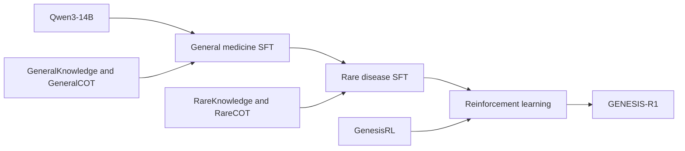

# GENESIS model and training

GENESIS combines a medical reasoning model with three complementary evidence pathways and iterative evidence review. GENESIS-R1 proposes and revises a differential diagnosis; the evidence pathways evaluate the candidates using expert agreement, biomedical knowledge and similar cases.

## Model architecture

GENESIS-R1 is initialised from Qwen3-14B, an approximately 14-billion-parameter language model. Adaptation first develops general clinical reasoning, then extends this foundation to rare-disease knowledge and diagnostic reasoning. Supervised fine-tuning (SFT) uses knowledge question–answer pairs and structured diagnostic trajectories. Reinforcement learning (RL) further develops diagnostic reasoning across general and rare diseases.

## Training datasets

Counts below describe the training-resource composition reported in the manuscript. The unit is a question–answer pair, a reasoning trajectory or an RL prompt, as specified for each resource.

| Resource | Records | Unit | Training role |
| --- | ---: | --- | --- |
| GeneralKnowledge | 102,563 | Knowledge question–answer pairs | General medicine SFT |
| GeneralCOT | 139,573 | Structured diagnostic trajectories | General medicine SFT |
| RareKnowledge | 64,099 | Knowledge question–answer pairs | Rare disease SFT |
| RareCOT | 103,282 | Structured diagnostic trajectories | Rare disease SFT |
| GenesisRL | 21,497 | Rollout prompts | RL across general and rare diseases |
| RL validation | 100 | Held-out prompts | Validation |

### General medicine resources

**GeneralKnowledge** covers clinical presentation, differential diagnosis, disease mechanisms, investigation selection and therapeutic decision-making. Sources include ICD-10 and MONDO; national clinical guidelines, expert consensus statements and care pathways; antimicrobial prescribing principles and drug references; PubTator; PrimeKG and Monarch; and the MIMIC-IV and PMC-Patients case corpora.

**GeneralCOT** contains diagnostic trajectories constructed from MIMIC-IV and PMC-Patients. Free-text cases are presented with different amounts of clinical information to support reasoning from both complete and restricted case descriptions.

### Rare disease resources

**RareKnowledge** represents rare-disease knowledge derived from HPO, Orphanet, OMIM, MONDO and MAxO as question–answer pairs.

**RareCOT** contains structured trajectories constructed from RareArena cases outside the evaluation split. Trajectories represent hypothesis generation, evidence assessment and diagnostic revision. Input construction varies both representation (clinical text or standardised phenotype terms) and information completeness (full or partial).

### Reinforcement learning resources

**GenesisRL** combines general-medicine and rare-disease prompts in a shared curriculum. Tasks span hard and extreme difficulty levels, with a shared reward framework across the disease-prevalence spectrum. Multi-source knowledge and reflection-enhanced sampling support exposure to alternative reasoning paths. The validation set contains 100 additional prompts.

## From training to inference

Knowledge question–answer pairs support disease understanding, diagnostic trajectories teach hypothesis evaluation, and RL refines the diagnostic reasoning process. At inference, GENESIS-R1 supplies a structured candidate set to the multi-agent workflow. Retrieved evidence remains associated with the candidate it supports or challenges, and an audit can return the case for revision.

See [Resources](resources.md) for the knowledge and case collections, [Inference](inference.md) for the workflow, and [Prompts](prompts.md) for the complete prompt templates.
