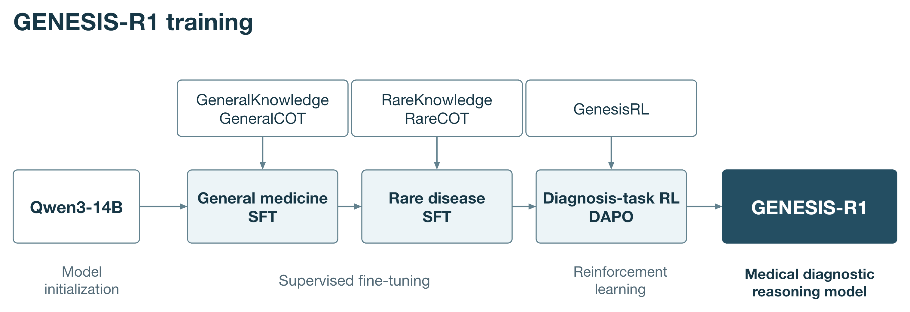

# GENESIS 模型说明

[English](../model_documentation.md) | 简体中文

## 模型与训练

GENESIS 是完整的多智能体诊断系统。GENESIS-R1 是 GENESIS 中使用的、经过训练的医学推理模型。GENESIS 将三个互补证据路径与迭代证据审查结合。GENESIS-R1 执行 Initial differential diagnosis，以及 Multi-expert consensus、Dynamic knowledge retrieval and deduction 和 Historical-case analogy 中的诊断推理，随后完成 Evidence fusion，并在需要时进行 Evidence-consistency audit 和 Revised differential diagnosis。辅助模型处理临床表现和检索记录；嵌入模型支持检索。

### 模型架构

GENESIS-R1 是面向医学诊断的专业推理模型，通过医学知识和诊断思维链的监督微调（SFT），以及诊断任务的强化学习（RL）训练得到。训练首先培养通用临床推理能力，再扩展至罕见病知识和诊断推理。知识问答对用于学习疾病知识，诊断思维链用于学习如何联系临床表现、比较诊断假设并修正推理。

模型使用约 140 亿参数的 Qwen3-14B 初始化。



### 推理阶段模型分工

GENESIS-R1 负责 Initial differential diagnosis、三个证据路径中的诊断推理、Evidence fusion、Evidence-consistency audit 及 Revised differential diagnosis。Final diagnosis 是最后完成的一轮返回的最终结果，不需要单独调用模型。

辅助语言模型是用于快速处理简单辅助任务的较小模型：提取用于 HPO 映射的临床表现、检查检索材料与候选诊断的相关性，以及从检索得到的长文档中提取有效片段。这些任务采用 Qwen3-8B。

Qwen3-Embedding-8B 是独立的嵌入模型，生成用于检索的向量表示。BioLORD-2023 将临床术语映射到本体概念，MedCPT-Cross-Encoder 对检索相关性评分。

### 训练数据集

以下数量描述论文中报告的训练资源构成。各资源的计数单位分别为知识问答对、诊断思维链或基于病例的 RL 提示，具体见表。

| 资源 | 记录数 | 单位 | 训练用途 |
| --- | ---: | --- | --- |
| GeneralKnowledge | 102,563 | 知识问答对 | 通用医学 SFT |
| GeneralCOT | 139,573 | 诊断思维链 | 通用医学 SFT |
| RareKnowledge | 64,099 | 知识问答对 | 罕见病 SFT |
| RareCOT | 103,282 | 诊断思维链 | 罕见病 SFT |
| GenesisRL | 21,497 | 基于病例的诊断提示 | 通用医学与罕见病诊断任务 RL |
| RL 验证集 | 100 | 留出提示 | 验证 |

#### 通用医学资源

**GeneralKnowledge** 涵盖临床表现、鉴别诊断、疾病机制、检查选择和治疗决策。来源包括 ICD-10 和 MONDO；国家临床指南、专家共识及诊疗路径；抗菌药物处方原则和药物参考资料；PubTator；PrimeKG 和 Monarch；以及 MIMIC-IV 与 PMC-Patients 病例语料库。

**GeneralCOT** 包含从 MIMIC-IV 和 PMC-Patients 构建的诊断思维链。自由文本病例采用不同的临床信息量呈现，以支持基于完整及有限病例描述的推理。

#### 罕见病资源

**RareKnowledge** 将来自 HPO、Orphanet、OMIM、MONDO 和 MAxO 的罕见病知识组织为知识问答对。

**RareCOT** 包含利用 RareArena 中评估划分以外的病例构建的诊断思维链，体现假设生成、证据评估和诊断修订。为增加输入多样性并构造不同难度的诊断任务，同一病例可以用临床叙述或标准化表型术语呈现。同时改变可用信息的多少：部分输入保留完整病例描述，另一些输入则遮蔽部分临床信息。这样，模型可以学习在不同输入形式、不同诊断线索充分程度下进行推理。

#### 强化学习资源

**GenesisRL** 是用于诊断任务强化学习的数据集，包含 21,497 条基于病例构建的训练提示。病历来自前文介绍的 MIMIC-IV、PMC-Patients 和 RareArena 病例数据集，覆盖通用医学及罕见病。模型根据给定的临床信息推导诊断结论。训练将困难和极难病例纳入同一课程，另外保留 100 条提示用于验证。

强化学习阶段采用 DAPO，在这些病例诊断任务上优化推理能力，沿用[我们的前置工作 RareDxR1](https://arxiv.org/abs/2607.00147)（III-E 节）所述的训练方法。通用医学和罕见病任务采用统一的奖励框架。

奖励设计包含以下五项：

- **Accuracy Reward（准确性奖励）：** 鼓励诊断答案与参考诊断一致。
- **Answer Format（答案格式）：** 鼓励输出符合要求的答案格式。
- **Language Consistency（语言一致性）：** 鼓励回答前后使用一致的语言。
- **Non-Repetitive（避免重复）：** 抑制冗余或重复文本。
- **Overlength Penalty（超长惩罚）：** 对超过配置长度限制的回答施加惩罚。

### 从训练到推理

知识问答对支持疾病理解，诊断思维链用于学习假设评估，RL 进一步改进诊断推理过程。推理时，GENESIS-R1 向多智能体工作流提供排序后的候选诊断集合。检索证据始终与其支持或质疑的候选诊断关联，审查结果可使病例进入修订流程。

## 合成数据构建

### 知识问答对

结构化本体记录、疾病描述和临床参考材料被组织为知识问答条目。通用医学条目覆盖临床表现、疾病机制、鉴别诊断、检查及诊疗管理；罕见病条目来源于 HPO、Orphanet、OMIM、MONDO 和 MAxO。

### 诊断思维链

诊断思维链采用[前置工作 RareDxR1](https://arxiv.org/abs/2607.00147)（III-D 节）提出的反思增强推理采样（Reflection-Enhanced Reasoning Sampling，RERS）采集。该方法在拒绝采样基础上复用初次生成失败的样本：教师模型结合检索知识和其他诊断模型的反馈，重新审视失败推理并生成修正后的思维链。生成结果经过诊断正确性和事实一致性检查后，再纳入训练数据。

为增加输入多样性并构造不同难度的诊断任务，同一病例可以用临床叙述或标准化表型术语呈现。同时改变可用信息的多少：部分输入保留完整病例描述，另一些输入则遮蔽部分临床信息。这样，模型可以学习在不同输入形式、不同诊断线索充分程度下进行推理。 其中，部分信息输入通过随机遮蔽临床叙述中的部分内容构建。

### 强化学习提示

来自 MIMIC-IV、PMC-Patients 和 RareArena 的临床病例被转化为 GenesisRL 的诊断任务提示。训练集包含 21,497 条提示，涵盖困难和极难等级，另外保留 100 条提示用于验证。

## 质量审查标准

训练条目审查评估诊断结论与参考诊断的一致性，并核查诊断思维链中的事实是否与该诊断相关知识一致。初始生成未得到参考诊断时，通过反思修订提供更正后的推理路径。

对于基于记录构建的训练条目，移除含有诊断信息的输入字段，并从结构化编码获取参考诊断。数据构建说明规定移除出院诊断、入院诊断和主诉字段。属于评估集的病例在构建前排除。

## 许可与访问

GENESIS 代码和仓库原创示例以 Apache License 2.0 发布。训练来源、模型权重、本体和临床语料库仍遵循各自的许可及访问协议。OMIM 按其许可条款访问；MIMIC-IV 按其要求资质认证的数据使用协议访问。源自文献的记录保留原出版物的访问和再利用条件。模型及嵌入模型权重按相应提供方的模型许可获取。

下方资源清单区分上游版本标识与采集日期，并说明各资源的用途。

## 数据与知识资源

资源按其在模型开发和推理中的用途组织。资源版本标识上游内容的版本；本地快照日期标识内容的采集时间。语料规模指已建立索引的资源数量，而非评估样本数量。

### 本体与知识库

资源清单记录的本地采集快照日期为 2025 年 8 月 25 日。各本体的独立版本标识列于下表。

| 资源 | 版本或快照 | 内容与用途 |
| --- | --- | --- |
| [HPO](https://hpo.jax.org/) | 2025-05-06 | 19,650 个术语；提供表型层级、同义词及定义。其中包含定义的 17,232 个术语用于概念规范化。 |
| [OMIM](https://www.omim.org/) | 本地快照，2025-08-25 | 疾病条目、Clinical Synopsis、基因、表型映射和关联文献；通过本地许可访问。 |
| [Orphanet](https://www.orphadata.com/) | ORDO 4.6；HOOM 2.3；配套命名包 | 罕见病名称、分类、基因关联及表型；涵盖 6,000 多种罕见病。 |
| [MONDO](https://mondo.monarchinitiative.org/) | 2025-06-03 | 疾病标识符、同义词及跨资源映射；用于统一术语。 |
| [MAxO](https://github.com/monarch-initiative/MAxO) | 2025-04-24 | 医疗行动及疾病–表型注释，用于诊断与管理知识。 |
| [PubMed](https://pubmed.ncbi.nlm.nih.gov/) | 训练文献截至 2025 年 5 月 | 用于训练资源构建和候选诊断相关文献证据的生物医学文献。在线检索使用 NCBI E-utilities。 |

### 病例库

| 资源 | 收录情况 | 表示形式与用途 |
| --- | --- | --- |
| [MIMIC-IV](https://physionet.org/content/mimiciv/) | 本地索引的临床记录 | 病例叙述和表型概况；疾病名称与 Orphanet 统一。访问遵循来源数据使用协议。 |
| RareArena | 约 50,000 个病例；4,000 多种疾病 | 罕见病临床表现，用于诊断思维链采集和病例类比。 |
| [PMC-Patients](https://github.com/pmc-patients/pmc-patients) | 167,035 份患者描述 | 从 PubMed Central 病例报告提取的患者描述；用于本地病例和文献检索。 |

病例检索可使用表型术语、临床叙述表示及候选疾病名称。检索病例为候选诊断的证据记录提供支持性或不一致的临床表现。

### 诊断工具与辅助模型

GENESIS 是完整的多智能体诊断系统。GENESIS-R1 是 GENESIS 中使用的、经过训练的医学推理模型。较小的辅助语言模型用于快速处理简单辅助任务，采用 Qwen3-8B。Qwen3-Embedding-8B 是独立的检索嵌入模型。

| 组件 | 模型或服务 | 职责 |
| --- | --- | --- |
| 诊断推理模型 | GENESIS-R1 | 生成候选诊断、解释证据、独立评估历史病例类比，并完成融合、审查及修订。 |
| 基于表型的诊断模型 | PhenoBrain | 根据标准化表型集合对罕见病候选诊断排序。 |
| 表型到病例服务 | PubCaseFinder | 根据表型，面向 Orphanet 和 OMIM 疾病提供诊断排序。 |
| 生物医学概念编码器 | BioLORD-2023 | 通过稠密检索，将表型和疾病名称映射到本体概念。 |
| 病例相关性模型 | MedCPT-Cross-Encoder | 对检索病例与查询病例的相关性评分。 |
| 辅助语言模型 | Qwen3-8B | 提取用于 HPO 映射的临床表现、检查检索材料与候选诊断的对应关系，并提取长文档中的有效片段。 |
| 嵌入模型 | Qwen3-Embedding-8B | 为知识和病例检索生成稠密表示。 |

这些组件通过仓库的工具接口接入。其职责独立于编排代码，因此可通过相同接口连接本地部署的服务和索引。

### 外部检索工具与服务

除本地知识和病例索引外，GENESIS 在允许联网时还可使用外部检索服务。PubMed 通过 NCBI E-utilities 提供生物医学文献；Wikipedia 和通用网页搜索提供附带可识别来源的补充信息。PhenoBrain 和 PubCaseFinder 向 Multi-expert consensus 提供表型驱动的疾病排序。各工具是否可用及其访问端点由部署配置决定。

通用网页搜索使用所配置适配器提供的搜索引擎。检索记录保留来源名称及可用的文献标识符或网址。PhenoBrain 和 PubCaseFinder 属于诊断工具，并非知识语料库。公共 PubCaseFinder、实时 PubMed、Wikipedia 和公共搜索引擎需要外网访问，即使通过本地 MCP 服务器转发也一样。只有服务后端及所需数据均位于本地时，本地部署的诊断服务才能在禁用外网时使用。

Crossref 和 MedlinePlus 不属于默认来源配置。联网及各来源的开关见[推理方法](inference.md#联网与来源配置)。

### 访问与来源归属

本仓库分发工作流代码、prompt 及原创示例病例。本体、模型权重、文献和临床语料库保留其来源许可及访问条件。OMIM 和 MIMIC-IV 按各自协议访问；资源使用者应从相应提供方获取这些材料。

## 多智能体组织结构与推理

GENESIS 是完整的多智能体诊断系统。GENESIS-R1 是 GENESIS 中使用的、经过训练的医学推理模型。

GENESIS 从 Initial differential diagnosis 开始，通过三个并行的证据路径评估候选诊断，再执行 Evidence fusion。需要进一步审查时，Evidence-consistency audit 指导 Revised differential diagnosis 及下一轮证据循环。原始临床叙述在整个流程中始终可用。

### 模型分工

GENESIS-R1 负责 Initial differential diagnosis、三个证据路径中的诊断推理、Evidence fusion、Evidence-consistency audit 及 Revised differential diagnosis。Final diagnosis 是最后完成的一轮返回的最终结果，不需要单独调用模型。

辅助语言模型是用于快速处理简单辅助任务的较小模型：提取用于 HPO 映射的临床表现、检查检索材料与候选诊断的相关性，以及从检索得到的长文档中提取有效片段。这些任务采用 Qwen3-8B。

Qwen3-Embedding-8B 是独立的嵌入模型，生成用于检索的向量表示。BioLORD-2023 将临床术语映射到本体概念，MedCPT-Cross-Encoder 对检索相关性评分。

### Initial differential diagnosis（初步鉴别诊断）

GENESIS-R1 接收临床文本、已出现的表现、明确未出现的表现以及要求的候选数量，返回排序后的候选诊断，包括疾病名称、支持表现、矛盾表现、尚未解决的问题及诊断理由。明确的阴性表现与未提供的信息分开处理。

### 三个证据路径

#### Multi-expert consensus（多专家共识）

独立诊断方法返回排序后的疾病列表。概念规范化统一不同疾病名称。代码根据候选诊断在各列表中是否出现及其相对位置计算一致性。GENESIS-R1 解释这种一致性的诊断意义，并识别当前鉴别诊断之外可信的其他诊断。其回复包含候选诊断评估及其他诊断建议，由该路径整理为证据记录。

#### Dynamic knowledge retrieval and deduction（动态知识检索与推断）

GENESIS-R1 针对每个候选诊断，围绕典型特征、矛盾表现和疾病机制构建查询。初始检索预算允许每个候选诊断一次查询、每个来源三条记录；修订时允许每个候选诊断三次查询、每个来源十条记录。辅助模型可提取相关片段并判定证据立场；GENESIS-R1 在 Evidence fusion 中综合权衡这些材料。

配置了知识来源且启用该路径后，即可运行知识检索。`Tools.summarizer` 为可选项。未配置时，原始记录以中立立场传递。配置 `ModelEvidenceSummarizer(auxiliary)` 后，将提取相关片段，同时保留来源标识符和原始记录。如果该处理失败，仍保留检索所得的原始记录。

#### Historical-case analogy（历史病例类比）

根据病例索引的能力，历史病例可通过表型术语、临床叙述或候选疾病名称检索。无论采用哪种检索方式，辅助模型比较的都是检索病例记载的诊断与当前某个候选诊断，并考虑同义名称和公认亚型。仅有疾病名称匹配，不能说明临床表现相似，也不能据此诊断当前患者。

GENESIS-R1 独立比较当前患者与检索病例的症状、检查结果及病程，解释哪些相似点或差异支持或反对各候选诊断，以及仍有哪些不确定之处。如果当前患者的表现值得考虑其他诊断，模型可以提出检索病例中记载的其他疾病。诊断不在当前候选列表中的病例也会保留，供此比较使用。

比较结果及引用的病例记录一起传递给 Evidence fusion，并保留数据库名称及可用的病例或文献标识符，以便追溯证据来源。

如果未检索到病例，该路径不提供历史病例证据。如果 GENESIS-R1 的比较结果不可用，记载诊断与候选诊断匹配的原始记录仍可传递给后续阶段，但不会将名称匹配本身视为支持诊断的临床证据。

### Evidence fusion（证据融合）

GENESIS-R1 读取原始病例、当前鉴别诊断、积累的证据及建议考虑的其他诊断，返回排序后的鉴别诊断、诊断推理、建议检查、来源引用及反思标志。检索材料与临床病例冲突时，以临床病例为首要依据。

### Evidence-consistency audit and Revised differential diagnosis（证据一致性审查与修订鉴别诊断）

如果 Evidence fusion 请求反思，审查阶段会综合候选诊断分类、跨路径支持情况以及 GENESIS-R1 的证据评估。报告指出缺乏支持的论断、矛盾表现、证据缺口及其他诊断建议。GENESIS-R1 随后接收原始病例、先前候选诊断、积累的证据和审查结果，在下一轮证据循环前保留、删除、引入或重新排序候选诊断。

`max_rounds` 统计初始证据循环之后的修订次数。默认 `max_rounds=3` 允许一次初始循环加最多三次修订，即总计最多四次证据检索与融合循环。满足一致性标准时可提前结束。若要求总计最多三次循环，应设置 `max_rounds=2`。

设置 `use_reflection=False` 会跳过审查和修订。返回结果仍保留 Evidence fusion 是否要求进一步审查的状态；停用反思本身不表示已满足一致性标准。

### Final diagnosis（最终诊断）

Final diagnosis 展示最后完成的一轮所得的排序鉴别诊断、诊断推理、建议检查及证据来源。最终排序在 Evidence fusion 中生成，展示该结果无需额外调用模型。

### 本地部署

软件包要求 Python 3.10 或更高版本，仅使用标准库。以下配置将所有诊断模型调用分配给 GENESIS-R1，将辅助处理分配给 Qwen3-8B。模型由部署环境提供，应使用相应服务端点公布的模型标识符。

```python
from genesis import Config, Models, Tools, diagnose
from genesis.llm.openai_compat import OpenAIChat
from genesis.tools import ModelPhenotypeExtractor, ModelEvidenceSummarizer

reasoner = OpenAIChat("http://localhost:8000/v1", "GENESIS-R1")
auxiliary = OpenAIChat("http://localhost:8001/v1", "Qwen3-8B", thinking=False)
models = Models(reasoner=reasoner, auxiliary=auxiliary)
tools = Tools(
    phenotype_extractor=ModelPhenotypeExtractor(auxiliary),
    summarizer=ModelEvidenceSummarizer(auxiliary),
    # Attach expert_methods, knowledge_sources and case_indices here.
    # Configure embedding and ontology encoders in those tool implementations.
)
config = Config(k=5, max_rounds=3)
```

表型适配器输出临床表现、明确阴性表现及对应的原文片段；HPO 标识符由配置的本体映射工具分配。辅助模型负责从文本提取临床表现，而非生成本体标识符。

在未配置独立辅助端点的最小部署中，疾病匹配检查使用 `reasoner`；表现提取与片段处理仍是可选工具。构造参数 `worker` 是同一 `reasoner` 对象的兼容别名。独立模型应通过 `auxiliary` 传入，而非 `worker`。


### 联网与来源配置

联网权限和各来源开关可分别配置。配置参数、本地部署示例和外部服务访问属性见[推理方法](inference.md#联网与来源配置)。
