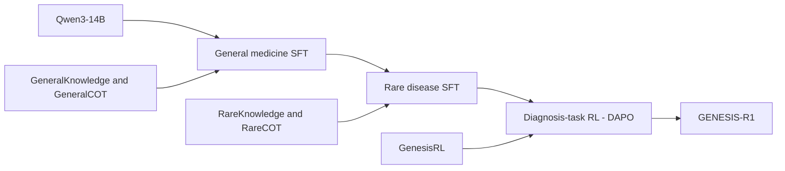

# GENESIS 模型与训练

[English](../model_training.md) | 简体中文

GENESIS 是完整的多智能体诊断系统。GENESIS-R1 是 GENESIS 中使用的、经过训练的医学推理模型。GENESIS 将三个互补证据路径与迭代证据审查结合。GENESIS-R1 执行 Initial differential diagnosis，以及 Multi-expert consensus、Dynamic knowledge retrieval and deduction 和 Historical-case analogy 中的诊断推理，随后完成 Evidence fusion，并在需要时进行 Evidence-consistency audit 和 Revised differential diagnosis。辅助模型处理临床表现和检索记录；嵌入模型支持检索。

## 模型架构

GENESIS-R1 是面向医学诊断的专业推理模型，通过医学知识和诊断思维链的监督微调（SFT），以及诊断任务的强化学习（RL）训练得到。训练首先培养通用临床推理能力，再扩展至罕见病知识和诊断推理。知识问答对用于学习疾病知识，诊断思维链用于学习如何联系临床表现、比较诊断假设并修正推理。

模型使用约 140 亿参数的 Qwen3-14B 初始化。

## 推理阶段模型分工

GENESIS-R1 负责 Initial differential diagnosis、三个证据路径中的诊断推理、Evidence fusion、Evidence-consistency audit 及 Revised differential diagnosis。Final diagnosis 是最后完成的一轮返回的最终结果，不需要单独调用模型。

辅助语言模型是用于快速处理简单辅助任务的较小模型：提取用于 HPO 映射的临床表现、检查检索材料与候选诊断的相关性，以及从检索得到的长文档中提取有效片段。这些任务采用 Qwen3-8B。

Qwen3-Embedding-8B 是独立的嵌入模型，生成用于检索的向量表示。BioLORD-2023 将临床术语映射到本体概念，MedCPT-Cross-Encoder 对检索相关性评分。

## 训练数据集

以下数量描述论文中报告的训练资源构成。各资源的计数单位分别为知识问答对、诊断思维链或基于病例的 RL 提示，具体见表。

| 资源 | 记录数 | 单位 | 训练用途 |
| --- | ---: | --- | --- |
| GeneralKnowledge | 102,563 | 知识问答对 | 通用医学 SFT |
| GeneralCOT | 139,573 | 诊断思维链 | 通用医学 SFT |
| RareKnowledge | 64,099 | 知识问答对 | 罕见病 SFT |
| RareCOT | 103,282 | 诊断思维链 | 罕见病 SFT |
| GenesisRL | 21,497 | 基于病例的诊断提示 | 通用医学与罕见病诊断任务 RL |
| RL 验证集 | 100 | 留出提示 | 验证 |

### 通用医学资源

**GeneralKnowledge** 涵盖临床表现、鉴别诊断、疾病机制、检查选择和治疗决策。来源包括 ICD-10 和 MONDO；国家临床指南、专家共识及诊疗路径；抗菌药物处方原则和药物参考资料；PubTator；PrimeKG 和 Monarch；以及 MIMIC-IV 与 PMC-Patients 病例语料库。

**GeneralCOT** 包含从 MIMIC-IV 和 PMC-Patients 构建的诊断思维链。自由文本病例采用不同的临床信息量呈现，以支持基于完整及有限病例描述的推理。

### 罕见病资源

**RareKnowledge** 将来自 HPO、Orphanet、OMIM、MONDO 和 MAxO 的罕见病知识组织为知识问答对。

**RareCOT** 包含利用 RareArena 中评估划分以外的病例构建的诊断思维链，体现假设生成、证据评估和诊断修订。为增加输入多样性并构造不同难度的诊断任务，同一病例可以用临床叙述或标准化表型术语呈现。同时改变可用信息的多少：部分输入保留完整病例描述，另一些输入则遮蔽部分临床信息。这样，模型可以学习在不同输入形式、不同诊断线索充分程度下进行推理。

### 诊断思维链采集

诊断思维链采用[前置工作 RareDxR1](https://arxiv.org/abs/2607.00147)（III-D 节）提出的反思增强推理采样（Reflection-Enhanced Reasoning Sampling，RERS）采集。该方法在拒绝采样基础上复用初次生成失败的样本：教师模型结合检索知识和其他诊断模型的反馈，重新审视失败推理并生成修正后的思维链。生成结果经过诊断正确性和事实一致性检查后，再纳入训练数据。

### 强化学习资源

**GenesisRL** 是用于诊断任务强化学习的数据集，包含 21,497 条基于病例构建的训练提示。病历来自前文介绍的 MIMIC-IV、PMC-Patients 和 RareArena 病例数据集，覆盖通用医学及罕见病。模型根据给定的临床信息推导诊断结论。训练将困难和极难病例纳入同一课程，另外保留 100 条提示用于验证。

强化学习阶段采用 DAPO，在这些病例诊断任务上优化推理能力，沿用[我们的前置工作 RareDxR1](https://arxiv.org/abs/2607.00147)（III-E 节）所述的训练方法。通用医学和罕见病任务采用统一的奖励框架。

奖励设计包含以下五项：

- **Accuracy Reward（准确性奖励）：** 鼓励诊断答案与参考诊断一致。
- **Answer Format（答案格式）：** 鼓励输出符合要求的答案格式。
- **Language Consistency（语言一致性）：** 鼓励回答前后使用一致的语言。
- **Non-Repetitive（避免重复）：** 抑制冗余或重复文本。
- **Overlength Penalty（超长惩罚）：** 对超过配置长度限制的回答施加惩罚。

## 从训练到推理

知识问答对支持疾病理解，诊断思维链用于学习假设评估，RL 进一步改进诊断推理过程。推理时，GENESIS-R1 向多智能体工作流提供排序后的候选诊断集合。检索证据始终与其支持或质疑的候选诊断关联，审查结果可使病例进入修订流程。

知识及病例集合参见[资源说明](resources.md)，工作流参见[推理方法](inference.md)，完整模板参见 [Prompt 参考](prompts.md)。
